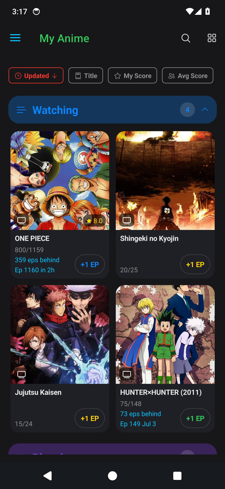
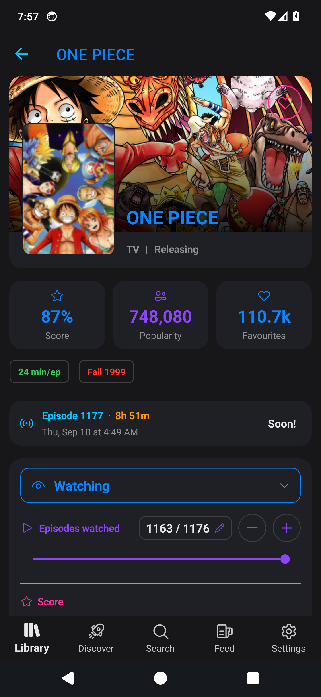
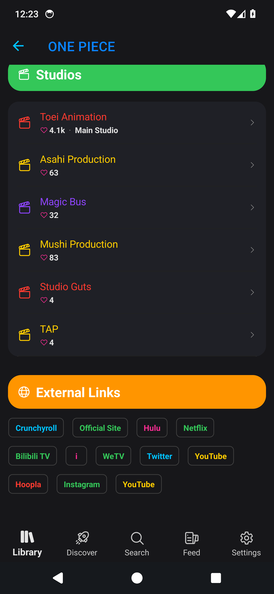
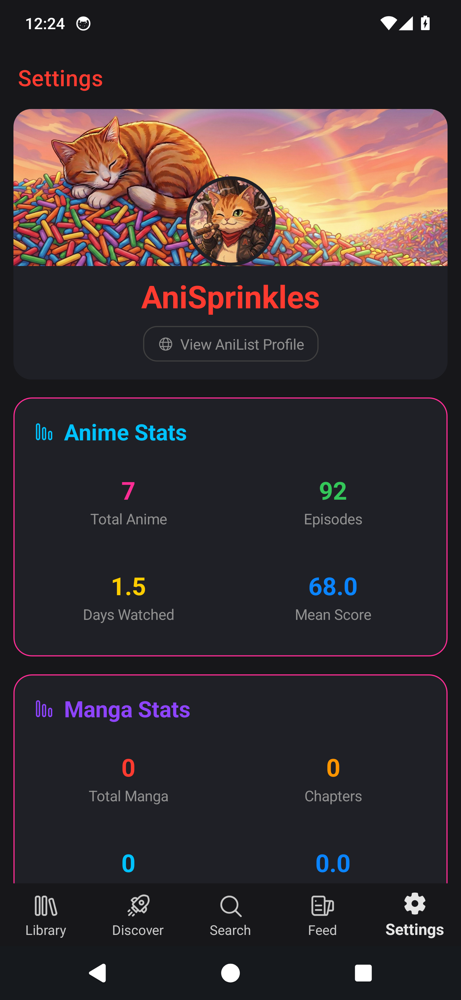

<div align="center">
  

# AniSprinkles

A colourful .NET MAUI Android app for tracking your anime with [AniList](https://anilist.co).

[](https://github.com/zhollis21/AniSprinkles/actions/workflows/ci-build-and-preview.yml)
[](https://github.com/zhollis21/AniSprinkles/actions/workflows/android-release.yml)


</div>

---

## Screenshots

| Library | Media Details | Character | Staff | Settings |
| :---: | :---: | :---: | :---: | :---: |
|  |  |  |  |  |

> Screenshots generated automatically by CI using compile-time stub services — no OAuth token required.

---

## Features

- **Library** — your anime list grouped by status (Watching, Rewatching, Planning, Completed, Paused, Dropped) with collapsible sections, sort controls, and pull-to-refresh; an Anime/Manga sub-tab strip sits above it, with manga still to come
- **Discover** — Currently Airing, Trending Now, Top Anime, Top Movies, All Time Popular, and Upcoming Next Season rows (plus optional 18+ rows) with infinite scrolling and "View All" browse lists; works signed-out, and shows your list status on every card when signed in
- **Search** — debounced search across all of AniList on its own tab, with infinite scrolling; works signed-out, and shows your list status on every result when signed in
- **Quick list actions** — long-press any anime (in your list, Discover, browse, or search) to add it to a list or edit progress, rating, and status without leaving the page
- **Media details** — full AniList metadata: synopsis with Read more/Show less, scores, airing schedule, genres, tags, rankings, studios, staff, related media, external links, and trailer
- **List entry editing** — update watch progress, score, and status directly from the details page; changes sync back to AniList
- **AniList sign-in** — OAuth implicit grant via the system browser; token stored in Android SecureStorage
- **Settings** — title language, score format, adult content toggle, notification preferences; settings synced from and saved to your AniList account
- **Airing notifications** — background WorkManager job polls AniList's public airing schedule every 15 minutes and posts local notifications when tracked episodes air
- **Error handling** — classified error views with retry across all pages; technical details toggle for debugging

---

## Planned

See the [open feature backlog](https://github.com/zhollis21/AniSprinkles/issues?q=is%3Aopen+label%3Afeature+sort%3Areactions-desc) on GitHub Issues.

---

## Building

Requires the [.NET 10 SDK](https://dotnet.microsoft.com/download) and the `maui-android` workload:

```powershell
dotnet workload install maui-android
```

```powershell
# Debug compile (type-check + analyzers). NOT an installable APK: without
# EmbedAssembliesIntoApk this leaves a ~19 MB Fast Deployment package that aborts
# at launch with no managed stack trace.
dotnet build src/AniSprinkles/AniSprinkles.csproj -c Debug -f net10.0-android

# Debug APK you can actually install (~97 MB)
dotnet build src/AniSprinkles/AniSprinkles.csproj -c Debug -f net10.0-android -p:EmbedAssembliesIntoApk=true

# Release AAB
dotnet publish src/AniSprinkles/AniSprinkles.csproj -c Release -f net10.0-android -p:AndroidPackageFormat=aab -o output

# CI build — compile-time stub services, no OAuth token required
dotnet build src/AniSprinkles/AniSprinkles.csproj -c Debug -f net10.0-android -p:EmbedAssembliesIntoApk=true -p:CiBuild=true
```

---

## Architecture

| Concern    | Choice                                                                                     |
| ---------- | ------------------------------------------------------------------------------------------ |
| Platform   | .NET MAUI Android-only (`net10.0-android`, min SDK 31)                                     |
| Pattern    | MVVM — CommunityToolkit.Mvvm (`[ObservableProperty]`, `[RelayCommand]`)                    |
| Navigation | Shell bottom tab bar + programmatic details routes (`media-details`, `character-details`, `staff-details`, `studio-details`) |
| Auth       | AniList OAuth implicit grant; redirect URI `anisprinkles://auth`; token in `SecureStorage` |
| HTTP       | Singleton `HttpClient` with `LoggingHandler` (Bearer token redaction)                      |
| Background | WorkManager periodic job for airing notifications                                          |
| Telemetry  | Sentry crash reporting (`SendDefaultPii = false`, no performance tracing)                  |
| Logging    | `ILogger` + rotating async file log (Debug only); minimum level `Information`              |

---

## CI & Release

- **`ci-build-and-preview.yml`** — runs on every PR: builds with `-p:CiBuild=true`, captures and commits UI screenshots
- **`android-release.yml`** — triggers on GitHub Release publication: builds a signed AAB, uploads artifact and ProGuard mapping
- **`promote-release.yml`** — promotes between Play Console tracks (internal → alpha → beta → production)
- Version scheme: `ApplicationDisplayVersion` from release tag (`v1.2.3` → `1.2.3`); `ApplicationVersion` (versionCode) from `YYMMDDNNN`

---

## Docs

| File                                       | Purpose                                                                                                                    |
| ------------------------------------------ | -------------------------------------------------------------------------------------------------------------------------- |
| [`AGENTS.md`](AGENTS.md)                   | Architecture reference, conventions, build commands, and AI agent instructions                                             |
| [`DEVELOPER_NOTES.md`](DEVELOPER_NOTES.md) | Local dev notes: error simulation, troubleshooting tips                                                                    |
| [`.claude/skills/`](.claude/skills/)       | Workflow slash commands: `/ani-kickoff`, `/run-anisprinkles`, `/ani-debug`, `/ani-review`, `/ani-pr-feedback`, `/project-architecture`, `/airing-notifications` |
